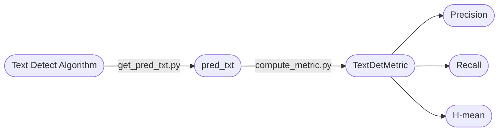

<div align="center">
  <div align="center">
    <h1><b>Text Detect Metric</b></h1>
  </div>

<a href=""></a>
<a href="">=3.6,<3.12-aff.svg"></a>
<a href="https://pypi.org/project/text_det_metric/"></a>
<a href="https://pepy.tech/project/text_det_metric"></a>
<a href="https://semver.org/"></a>
<a href="https://github.com/psf/black"></a>

</div>

### 简介

该库用于计算`Precision`、`Recall`和`H-mean`三个指标，用来快速评测文本检测算法效果，与[text_det_test_dataset](https://huggingface.co/datasets/SWHL/text_det_test_dataset)配套使用。

指标计算代码参考：[PaddleOCR](https://github.com/PaddlePaddle/PaddleOCR/blob/b13f99607653c220ba94df2a8650edac086b0f37/ppocr/metrics/eval_det_iou.py) 和 [DB](https://github.com/MhLiao/DB/blob/3c32b808d4412680310d3d28eeb6a2d5bf1566c5/concern/icdar2015_eval/detection/iou.py#L8)

### 整体框架



### 指定数据集上评测

如果想要评测其他文本检测算法，需要将预测结果写入`pred.txt`中，格式为`预测框坐标\t真实框坐标\t耗时`，详细可参考[link](./pred.txt)。示例如下：

```text
[[[85.0, 43.0], [164.0, 44.0], [164.0, 72.0], [85.0, 70.0]]] [[[473.36082474226805, 271.2938144329896], [520.7835051546391, 290.8814432989691]]] 0.14536070823669434
```

### 示例（评测`rapidocr_onnxruntime==1.3.16`）

1. 安装运行环境

    ```bash
    pip install rapidocr_onnxruntime==1.3.16
    pip install datasets
    pip install text_det_metric
    ```

2. 获得`pred.txt`文本文件

    ```python
    from pathlib import Path
    import cv2
    import numpy as np
    from datasets import load_dataset
    from rapidocr_onnxruntime import RapidOCR
    from tqdm import tqdm

    engine = RapidOCR()

    dataset = load_dataset("SWHL/text_det_test_dataset")
    test_data = dataset["test"]

    content = []
    for i, one_data in enumerate(tqdm(test_data)):
        img = np.array(one_data.get("image"))
        img = cv2.cvtColor(img, cv2.COLOR_RGB2BGR)

        dt_boxes, elapse = engine(img, use_det=True, use_cls=False, use_rec=False)

        dt_boxes = [] if dt_boxes is None else dt_boxes
        elapse = 0 if elapse is None else elapse[0]

        gt_boxes = [v["points"] for v in one_data["shapes"]]
        content.append(f"{dt_boxes}\t{gt_boxes}\t{elapse}")

    with open("pred.txt", "w", encoding="utf-8") as f:
        for v in content:
            f.write(f"{v}\n")
    ```

3. 计算指标

    ```python
    from text_det_metric import TextDetMetric

    metric = TextDetMetric()
    pred_path = "pred.txt"
    metric = metric(pred_path)
    print(metric)

    ```

4. 得到结果

    ```bash
    {'precision': 0.8301, 'recall': 0.8659, 'hmean': 0.8476, 'avg_elapse': 0.2246}
    ```
