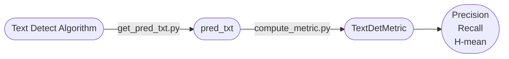

## Text Detect Metric
<p align="left">
    <a href=""></a>
    <a href="">=3.6,<3.12-aff.svg"></a>
    <a href="https://pypi.org/project/text_det_metric/"></a>
    <a href="https://pepy.tech/project/text_det_metric"></a>
<a href="https://semver.org/"></a>
    <a href="https://github.com/psf/black"></a>
</p>

- 该库用于计算`Precision`、`Recall`和`H-mean`三个指标，用来评测文本检测算法效果。与[魔搭-文本检测测试集](https://www.modelscope.cn/datasets/liekkas/text_det_test_dataset/summary)配套使用。
- 指标计算代码参考：[PaddleOCR](https://github.com/PaddlePaddle/PaddleOCR/blob/b13f99607653c220ba94df2a8650edac086b0f37/ppocr/metrics/eval_det_iou.py) 和 [DB](https://github.com/MhLiao/DB/blob/3c32b808d4412680310d3d28eeb6a2d5bf1566c5/concern/icdar2015_eval/detection/iou.py#L8)

#### 整体框架


#### 数据集上评测
- 这里以`ch_mobile_v2_det`在文本检测测试集[liekkas/text_det_test_dataset](https://www.modelscope.cn/datasets/liekkas/text_det_test_dataset/summary)上的评测代码，大家可以以此类推。
- 安装必要的包
    ```bash
    pip install modelscope==1.5.2
    pip install text_det_metric
    ```
- 运行测试
    1. 运行`get_pred_txt.py`得到`pred.txt`
        ```python
        import cv2
        from modelscope.msdatasets import MsDataset

        from ch_mobile_v2_det import TextDetector

        test_data = MsDataset.load(
            "text_det_test_dataset",
            namespace="liekkas",
            subset_name="default",
            split="test",
        )

        text_detector = TextDetector()

        content = []
        for one_data in test_data:
            img_path = one_data.get("image:FILE")

            print(img_path)
            img = cv2.imread(str(img_path))
            dt_boxes, scores, _ = text_detector(img)
            content.append(f"{img_path}\t{dt_boxes.tolist()}\t{scores}")

        with open("pred.txt", "w", encoding="utf-8") as f:
            for v in content:
                f.write(f"{v}\n")
        ```
    2. 运行`compute_metric.py`得到在该数据集上的指标
        ```python
        from text_det_metric import DetectionIoUEvaluator

        metric = DetectionIoUEvaluator()

        # pred_path
        pred_path = "1.txt"
        mertric = metric(pred_path)
        print(mertric)
        ```
