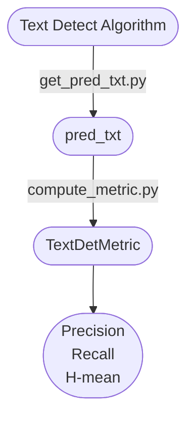

[简体中文](https://github.com/SWHL/TextDetMetric/blob/main/docs/README_zh.md) | English

## Text Detect Metric
<p align="left">
     <a href=""></a>
     <a href="">=3.6,<3.12-aff.svg"></a>
     <a href="https://pypi.org/project/text_det_metric/"></a>
     <a href="https://pepy.tech/project/text_det_metric"></a>
<a href="https://semver.org/"></a>
     <a href="https://github.com/psf/black"></a>
</p>

- This library is used to calculate the three metric `Precision`, `Recall` and `H-mean` to evaluate the effect of text detection algorithms. It is used in conjunction with [Modelscope-Text Detection Test Set](https://www.modelscope.cn/datasets/liekkas/text_det_test_dataset/summary).
- Indicator calculation code reference: [PaddleOCR](https://github.com/PaddlePaddle/PaddleOCR/blob/b13f99607653c220ba94df2a8650edac086b0f37/ppocr/metrics/eval_det_iou.py) and [DB](https://github.com/MhLiao/DB/blob/3c32b808d4412680310d3d28eeb6a2d5bf1566c5/concern/icdar2015_eval/detection/iou.py#L8)

#### Overall framework


#### Evaluation on custom dataset
- If you want to evaluate other text detection algorithms, you need to write the prediction results into `pre.txt` in the format of `image full path\t detection frame polygon coordinates\t elapse`
- ⚠️Note: The full path of the image is loaded from the modelscope, as long as `txt` and `json` are in the same directory.
- The following example:
    ```text
    C:\Users\xxxx\.cache\modelscope\hub\datasets\liekkas\text_det_test_dataset\master\data_files\extracted\f3ca4a17a478c1d798db96b03a5da8b144f13054fd06401e5a113a7ca4953491\text_det_test_data set/25.jpg [[[519.0, 634.0], [765.0, 632.0], [765.0, 683.0], [519.0, 685.0]]] 0.2804088592529297
    ```

#### Usage
Here is the evaluation code of `ch_ppocr_v3_det` on the text detection test set [liekkas/text_det_test_dataset](https://www.modelscope.cn/datasets/liekkas/text_det_test_dataset/summary), and you can use the same analogy.

1. Install necessary packages
    ```bash
    pip install modelscope==1.5.2
    pip install text_det_metric
    ```
2. Run [`get_pred_txt.py`](./get_pred_txt.py) to get `pred.txt`.
    <details>
        <summary>Click to expand</summary>
    
    ```python
    from pathlib import Path

    import cv2
    import yaml
    from modelscope.msdatasets import MsDataset
    from tqdm import tqdm

    from det_demos.ch_ppocr_v3_det import TextDetector

    root_dir = Path(__file__).resolve().parent


    def read_yaml(yaml_path):
        with open(yaml_path, "rb") as f:
            data = yaml.load(f, Loader=yaml.Loader)
        return data


    test_data = MsDataset.load(
        "text_det_test_dataset",
        namespace="liekkas",
        subset_name="default",
        split="test",
    )

    config_path = root_dir / 'det_demos' / 'ch_ppocr_v3_det' / 'config.yaml'
    config = read_yaml(str(config_path))

    # Configure the onnx model path.
    config['model_path'] = str(root_dir / 'det_demos' / config['model_path'])

    text_detector = TextDetector(config)

    content = []
    for one_data in tqdm(test_data):
        img_path = one_data.get("image:FILE")

        img = cv2.imread(str(img_path))
        dt_boxes, elapse = text_detector(img)
        content.append(f"{img_path}\t{dt_boxes.tolist()}\t{elapse}")

    with open("pred.txt", "w", encoding="utf-8") as f:
        for v in content:
            f.write(f"{v}\n")
    ```
    </details>

3. Run [`compute_metric.py`](./compute_metric.py) to get the metrics on the dataset.
    ```python
    from text_det_metric import DetectionIoUEvaluator

    metric = DetectionIoUEvaluator()

    # pred_path
    pred_path = "pred.txt"
    metric = metric(pred_path)
    print(metric)
    ```
4. Output
    ```python
    {
        'precision': 0.6958333333333333,
        'recall': 0.8608247422680413,
        'hmean': 0.7695852534562212,
        'avg_elapse': 2.0107483345529307
    }
    ```

#### ChangeLog
- 2023-08-26 v0.0.5 update:
    - Add `avg_elapse` metric.